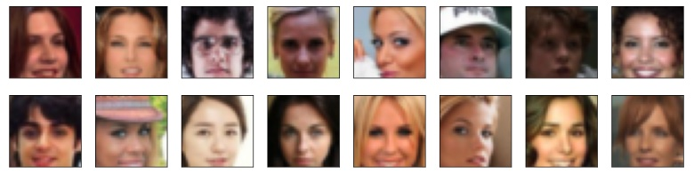
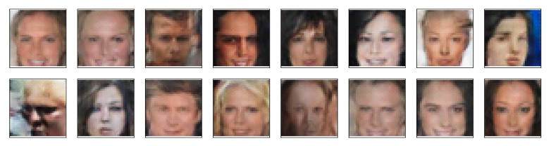

# Face Generation with a Convolutional Generative Adversarial Network (GAN)

This repository contains a Convolutional Generative Adversarial Network (GAN) that generates faces based on the [CelebFaces Attributes Dataset (CelebA)](http://mmlab.ie.cuhk.edu.hk/projects/CelebA.html). A subset of the dataset is used, which can be downloaded [from here](https://s3.amazonaws.com/video.udacity-data.com/topher/2018/November/5be7eb6f_processed-celeba-small/processed-celeba-small.zip). The subset, which consists of 89,931 images, has been processed to contain only of `64 x 64 x 3` cropped faces without any annotations. Here's a sample of 16 images:

<p align="center">
  
</p>

The project is implemented with [Pytorch](https://pytorch.org/) and it uses materials from the [Udacity Computer Vision Nanodegree](https://www.udacity.com/course/computer-vision-nanodegree--nd891), which can be obtained in their original (non-implemented) form in [project-face-generation](https://github.com/mxagar/deep-learning-v2-pytorch/tree/master/project-face-generation).

Regarding the *current* results, I would say they look like faces :sweat_smile:

<p align="center">
  
</p>

... but most of them would fail a human-level classification on whether they're real. However, I find it very remarkable that such a simple network with untuned hyperparameters from the literature and only 1.5h of GPU training is able to yield such face images. The section [Improvements](#improvements-and-next-steps) details how I will approach the next steps -- if I find time for that :sweat_smile:

Table of Contents:

- [Face Generation with a Convolutional Generative Adversarial Network (GAN)](#face-generation-with-a-convolutional-generative-adversarial-network-gan)
  - [How to Use This](#how-to-use-this)
    - [Overview of Files and Contents](#overview-of-files-and-contents)
    - [Dependencies](#dependencies)
  - [Brief Notes on Generative Adversarial Networks (GAN) and the Chosen Architecture](#brief-notes-on-generative-adversarial-networks-gan-and-the-chosen-architecture)
  - [Practical Implementation Notes](#practical-implementation-notes)
  - [Improvements and Next Steps](#improvements-and-next-steps)
  - [Interesting Links](#interesting-links)
  - [Authorship](#authorship)

## How to Use This

In order to use the model, you need to install the [dependencies](#dependencies) and execute the notebook [`dlnd_face_generation.ipynb`](dlnd_face_generation.ipynb), which is the main application file that defines and trains the network.

Next, I give a more detailed description on the contents and the usage.

### Overview of Files and Contents

Altogether, the project directory contains the following files and folders:

```
.
├── Instructions.md                     # Original project requirements
├── README.md                           # This file
├── assets/                             # Images used in the notebook
├── dl_face_generation.ipynb            # Implementation notebook
├── problem_unittests.py                # Unit tests
└── requirements.txt                    # Dependencies
```

As already introduced, the notebook [`dl_face_generation.ipynb`](dl_face_generation.ipynb) takes care of almost everything. The file [`problem_unittests.py`](problem_unittests.py) is used to check different parts of the notebook.

All in all, the following tasks are implemented in the project notebook:

- A data loader is defined, which is able to deliver `batch_size` number of images resized to `img_size`.
- An image scaling function is defined to map pixel values to `[-1,1]`.
- The Discriminator and the Generator models are defined with convolution and transpose convolution layers. Instead of pooling, strided convolutions are used, and batch normalization and leaky ReLU are are also applied, as in the original [DCGAN Paper](https://arxiv.org/abs/1511.06434v2).
- The models are instantiated and initialized with custom weights: `N(0, 0.02)`.
- The loss functions are defined: one for the real images and another one for the fake images produced by the Generator.
- The optimizers are defined using values from the [DCGAN Paper](https://arxiv.org/abs/1511.06434v2): one for the Discriminator and another one for the Generator.
- The typical GAN training loop is defined and executed.
- Learning curves (i.e., loss values) are plotted.
- Generated images from a fixed set of noise vectors is displayed for given epochs.

When the notebook is executed, several other artifacts are generated:

- A folder with the dataset: `processed_celeba_small/`
- A folder for the latest model saved after every epoch: `checkpoints_gan/`
- A file which contains the images generated from a fixed set of noise vectors every epoch: `train_samples.pkl`.

### Dependencies

You should create a python environment (e.g., with [conda](https://docs.conda.io/en/latest/)) and install the dependencies listed in the [requirements.txt](requirements.txt) file.

A short summary of commands required to have all in place is the following:

```bash
conda create -n text-gen python=3.6
conda activate text-gen
conda install pytorch -c pytorch 
conda install pip
pip install -r requirements.txt
```

## Brief Notes on Generative Adversarial Networks (GAN) and the Chosen Architecture

:construction:

TBD.

## Practical Implementation Notes

:construction:

TBD.

## Improvements and Next Steps

The current results are far from high quality faces such as in [StyleGAN 3, 2021](https://arxiv.org/abs/2106.12423); however, as mentioned in the introduction, I think it's remarkable that the defined simple model with untuned hyperparameters from the literature is able to generate those faces with only 1.5h of GPU training.

In case I have time, I will try to improve the results applying these items:

- [ ] Try the [Wasserstein distance](https://guimperarnau.com/blog/2017/03/Fantastic-GANs-and-where-to-find-them#wassGANs) in the loss function, since it correlates better with the image quality. That way, it's more clear when we should stop training.
- [ ] Increase the image size to `64 x 64` to create bigger images.
- [ ] Increase the number of channels (e.g., 2x or 4x), controlled with `conv_dim`.
- [ ] Padding and normalization techniques can achieve better qualities? Check literature.
- [ ] Vary the learning rate during training; example: [Original CycleGAN repository](https://github.com/junyanz/pytorch-CycleGAN-and-pix2pix).
- [ ] Try other weight initializations, e.g., the [Xavier Initialization](https://prateekvjoshi.com/2016/03/29/understanding-xavier-initialization-in-deep-neural-networks/).
- [ ] Currently, label smoothing is implemented but deactivated; activate it.
- [ ] Read thoroughly and the techniques commented in the the paper [Improved Techniques for Training GANs](https://arxiv.org/abs/1606.03498).
- [ ] I have barely varied the hyperparameters! I should systematically search in the paramater space; e.g.:
  - [ ] The number of epochs.
  - [ ] The `batch_size`; check [this Standford / Karpathy article](https://cs231n.github.io/neural-networks-3/#hyper).
  - [ ] The `beta` values for the optimizer; check [this article by Sebastian Ruder](https://ruder.io/optimizing-gradient-descent/index.html#adam).
  - [ ] The size of the random/noise vector.
  - [ ] The slope of the leaky ReLU.
  - [ ] etc.
- [ ] Address the bias in the dataset: many white, blonde and female faces are generated.
  - [ ] Re-sample the training dataset?
  - [ ] Use another dataset?
- [ ] Try architectures like [PairedCycleGAN](https://gfx.cs.princeton.edu/pubs/Chang_2018_PAS/Chang-CVPR-2018.pdf), in which face properties are mapped from one domain to another. I have implemented an example of a CycleGAN in which winter and summer domain image properties are mapped from one set to another: [CycleGAN Summer/Winter](https://github.com/mxagar/deep-learning-v2-pytorch/tree/master/cycle-gan).


## Interesting Links

- [My notes and code](https://github.com/mxagar/computer_vision_udacity) on the [Udacity Computer Vision Nanodegree](https://www.udacity.com/course/computer-vision-nanodegree--nd891).
- [My notes and code](https://github.com/mxagar/deep_learning_udacity) on the [Udacity Deep Learning Nanodegree](https://www.udacity.com/course/deep-learning-nanodegree--nd101).
- My toy project on [image captioning](https://github.com/mxagar/image_captioning).
- [iGAN: Interactive GANs](https://github.com/junyanz/iGAN)
- Pix2Pix paper: [Image-to-Image Translation with Conditional Adversarial Networks, Isola et al.](https://arxiv.org/pdf/1611.07004.pdf)
- [High-Resolution Image Synthesis and Semantic Manipulation with Conditional GANs](https://arxiv.org/pdf/1711.11585.pdf)
- [Image to Image demo](https://affinelayer.com/pixsrv/)
- CycleGAN paper: [Unpaired Image-to-Image Translation
using Cycle-Consistent Adversarial Networks](https://arxiv.org/pdf/1703.10593.pdf)
- [CyCleGAN & Pix2Pix Repo with Pytorch (by author Zhu)](https://github.com/junyanz/pytorch-CycleGAN-and-pix2pix)
- [DCGAN Tutorial, Pytorch](https://pytorch.org/tutorials/beginner/dcgan_faces_tutorial.html)
- [Cool GAN Applications](https://jonathan-hui.medium.com/gan-some-cool-applications-of-gans-4c9ecca35900)
- [Compilation of Cool GAN Projects](https://github.com/nashory/gans-awesome-applications).
- GAN paper: [Generative Adversarial Networks, 2014](https://arxiv.org/abs/1406.2661).
- [Improved Techniques for Training GANs, 2016](https://arxiv.org/abs/1606.03498).
- [DCGAN Paper, 2016](https://arxiv.org/abs/1511.06434v2).
- [Understanding the backward pass through Batch Normalization Layer](http://kratzert.github.io/2016/02/12/understanding-the-gradient-flow-through-the-batch-normalization-layer.html)
- [Different ReLU Methods](https://medium.com/@danqing/a-practical-guide-to-relu-b83ca804f1f7)

**Very realistic face generation**:

- [StyleGAN, 2019](https://arxiv.org/abs/1710.10196/).
- [StyleGAN 2, 2020](https://paperswithcode.com/method/stylegan2).
- [StyleGAN 3, 2021](https://arxiv.org/abs/2106.12423).

## Authorship

Mikel Sagardia, 2022.  
No guarantees.

You are free to use this project, but please link it back to the original source.
